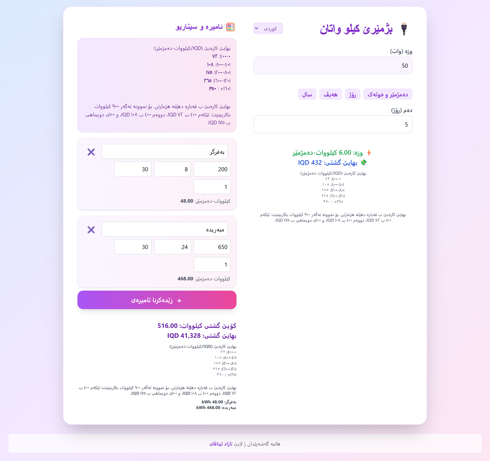

# Kurdistan kWh Calculator

A modern, responsive electricity usage and cost calculator for Kurdistan, supporting Kurdish, English, and Arabic. Calculates kWh and cost using the official Kurdistan residential block tariff system, and allows you to simulate multiple devices and scenarios.

## Features

- **Multi-language**: Kurdish, English, Arabic (auto-switch UI and all labels)
- **Block Tariff Calculation**: Uses Kurdistan's official residential electricity pricing (0-400, 401-800, etc.)
- **Device Scenarios**: Add/remove devices, set power, hours/day, days/month, months, and see total kWh and cost
- **Instant Calculation**: All results update automatically as you type
- **Clear Tariff Explanation**: Shows a translated explanation of the block pricing system
- **Responsive Design**: Works great on mobile and desktop
- **Modern UI**: Colorful, rounded, and easy to use

## How it works

1. **Main Calculator**: Enter device power and usage time (hours/minutes, days, months, or years). See kWh and cost instantly, with a clear breakdown of the tariff blocks.
2. **Devices & Scenarios**: Add as many devices as you want. For each device, enter:
   - Name (e.g. Fridge)
   - Power (Watts)
   - Hours per day
   - Days per month
   - Months
   - The app calculates kWh and cost for each device and the total for all devices.
3. **Tariff Info**: The app displays a clear, translated explanation of the block pricing system, so you always know how your bill is calculated.

## Tariff Example

If you use 900 kWh in a month:
- First 400 kWh × 72 IQD
- Next 400 kWh × 108 IQD
- Last 100 kWh × 175 IQD

## Usage

Just open `index.html` in your browser. No installation required.

## Screenshots

## License

MIT

---
دروستکراوە لەلایەن [ئازاد لیناڤای](https://github.com/azadlinavay) | Developed by [Azad Linavay](https://github.com/azadlinavay)
